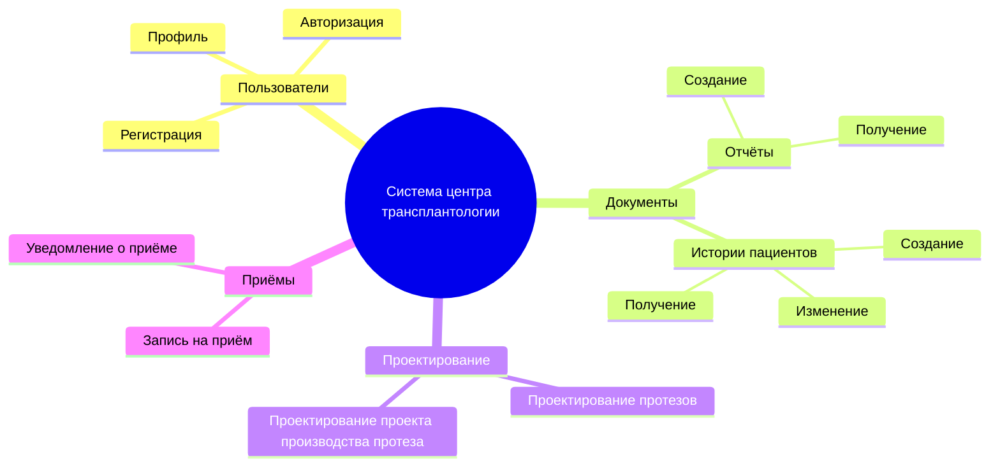
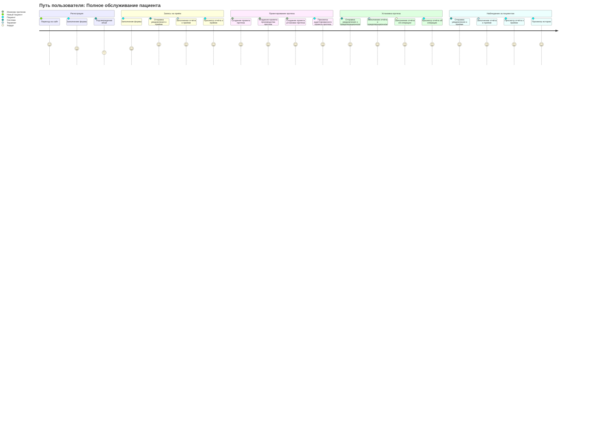
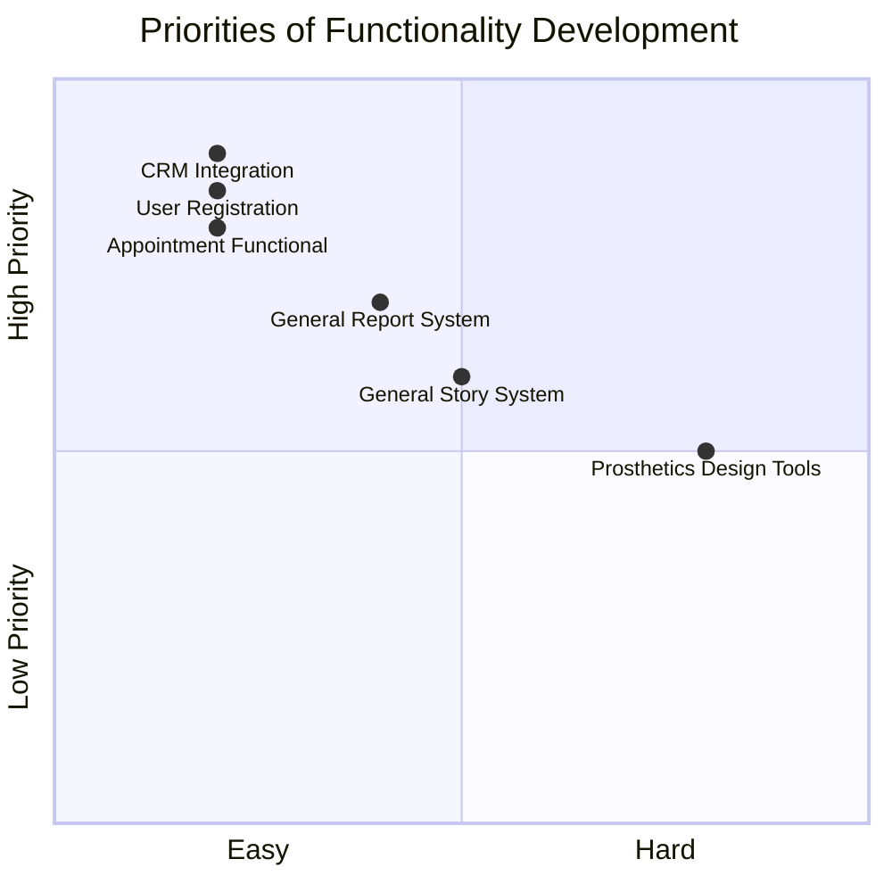
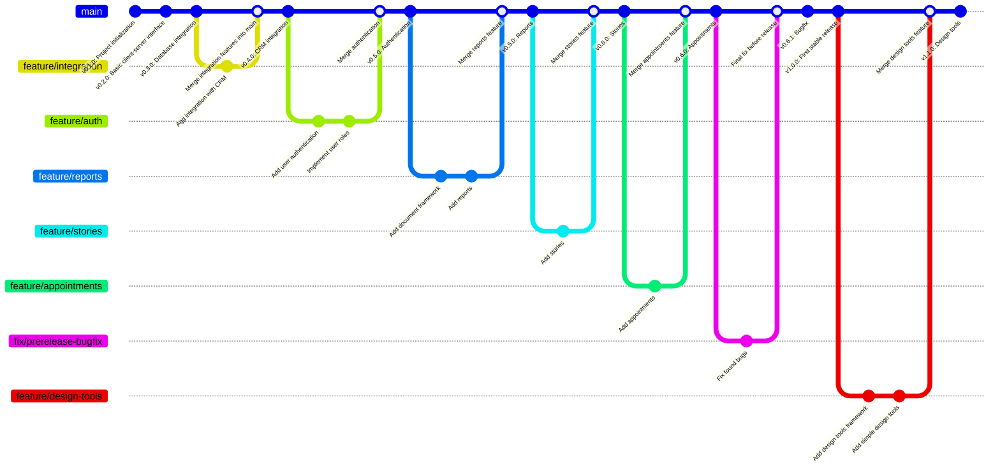

# Документирование системы центра трансплантологии

## 1. Структура функциональных возможностей (Mind Map)

### Описание:
Эта диаграмма иллюстрирует структуру функциональных возможностей системы обмена книгами. 
### Основные узлы и их значение:

* <u>Пользователи:</u> функционал, связанный с управлением учетными записями пользователей.
* <u>Документы:</u> функционал работы с различными документами.
* <u>Проектирование:</u> инструментарий для проектирования.
* <u>Приёмы:</u> функционал, связанный с приёмами.

## 2. Диаграмма путешествия пользователя (User Journey Diagram)

### Описание:
Диаграмма описывает ключевые этапы взаимодействия пользователя с системой:

* Регистрация: пациент создает учетную запись.
* Запись на приём: пациент записывается и получает приём у терапевта.
* Проектирование протеза: пациент смотрит на спроектированный для него протез.
* Установка протеза: пациенту устанавливают протез.
* Наблюдение за пациентом: пациент получает приём после установки.

## 3. Квадрант-граф (Prioritization Quadrant)

### Описание:
Квадрант-граф помогает приоритизировать разработку функций системы. Каждая точка соответствует функционалу:

* Ось X: сложность реализации (от простого к сложному).
* Ось Y: приоритет для пользователей (от низкого к высокому).

## 4. Гит граф (Gitgraph)

### Описание:
 Гит-граф показывает процесс разработки системы через версии:
1. Основная ветка (main): стабильные версии системы.
2. Функциональные ветки: каждая ветка посвящена отдельной функциональности.
3. Слияния: после завершения работы над веткой, изменения интегрируются в main.
